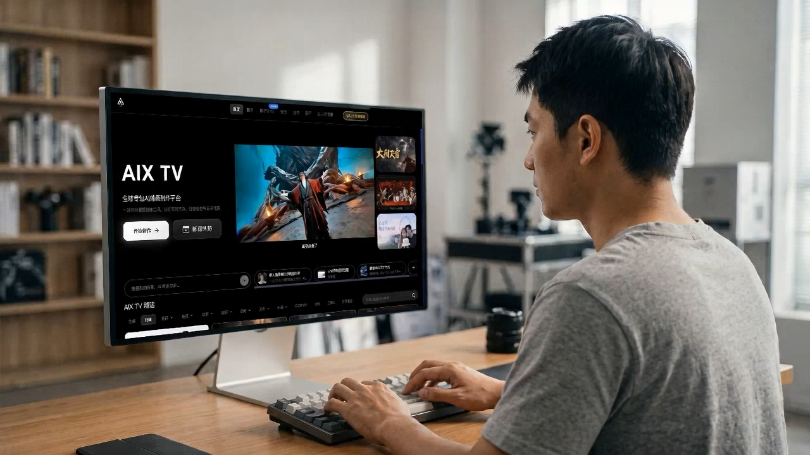
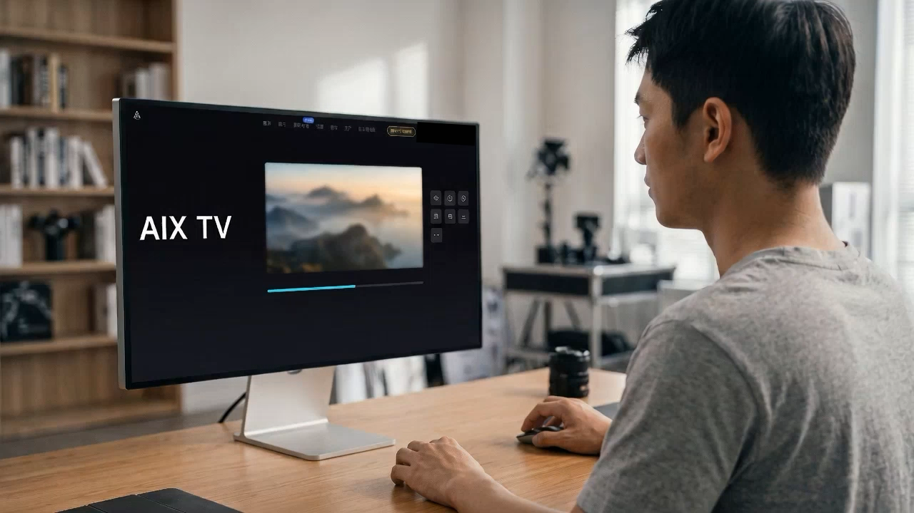
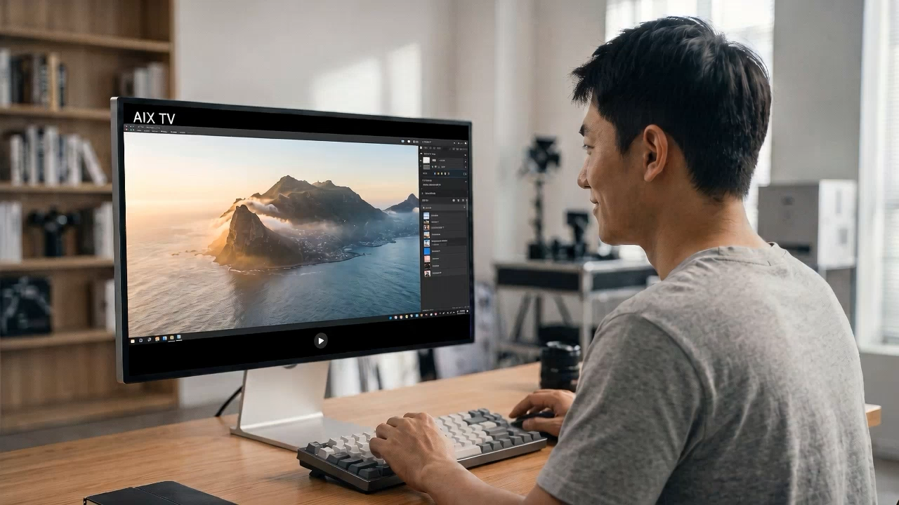

# 男生操作 AIX：从想法到成片

这条 15 秒案例展示一个连续的创作故事：男生打开 AIX 敲键盘，使用鼠标生成山海画面，最后查看成果并微笑。

| 时间 | 故事 | 素材 |
|---|---|---|
| 0–5 秒 | 输入想法，操作 AIX | 已有敲键盘镜头 |
| 5–10 秒 | 点击生成，画面逐渐清晰 | 新增 5 秒续镜 |
| 10–15 秒 | 查看山海成果，满意微笑 | 新增 5 秒续镜 |

人物、服装、显示器和桌面以同一张人物参考图保持衔接。两条新增素材分别经过 AIX PRO 静态图与 Seedance2.0（真人）图生视频，再原生下载。网站小字和成果界面由模型生成，代表故事化展示，不是精确的软件操作录屏。

三张生成图片和三条视频已导入新的 DaVinci Resolve Studio 工程；时间线各取 120 帧顺切，原生导出为 1280 × 720、24 fps、15.000 秒、360 帧的无声 MP4。原始素材保留在本地工程媒体目录。

[播放成片](aix-story.mp4)

上面三张图提取自经过遮罩处理的最终视频首帧。前两段屏幕右上角的账号样式控件已用随镜头移动的不透明遮罩覆盖。最终视频全部解码，240 个带遮罩帧的核心像素检查通过，并人工审阅了每镜头 9 个时间点的联系表及关键帧。原图未经过视频遮罩，未加入本案例附件。

本目录仅含成片、预览帧、文件哈希和检查说明。PNG 已移除附带元数据；MP4 元数据检查未发现账号或本机路径。原生工程、登录状态、任务账本、原始请求及失败导出不在本目录。文件对应关系见 `manifest.json`，检查范围见 `privacy-review.json`。

案例已随 [0.5.0 macOS 预览版](https://github.com/jonathanbigbro/aix-media-bridge/releases/tag/v0.5.0) 公开发布；本目录中的成片和预览图保持原先审阅通过的字节。
